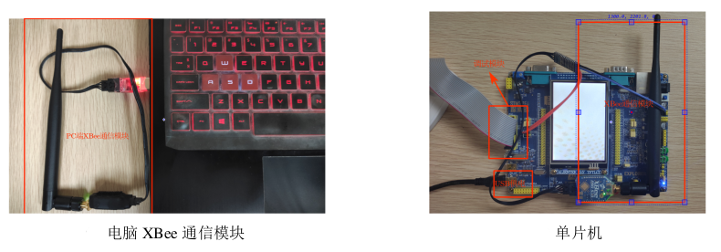
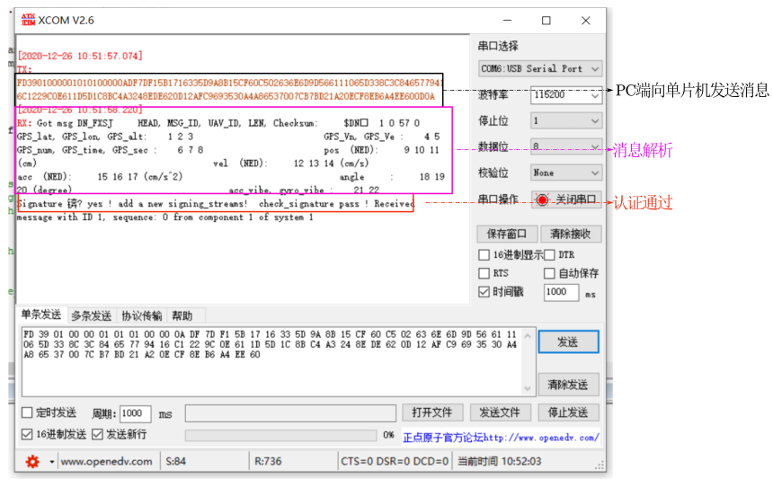
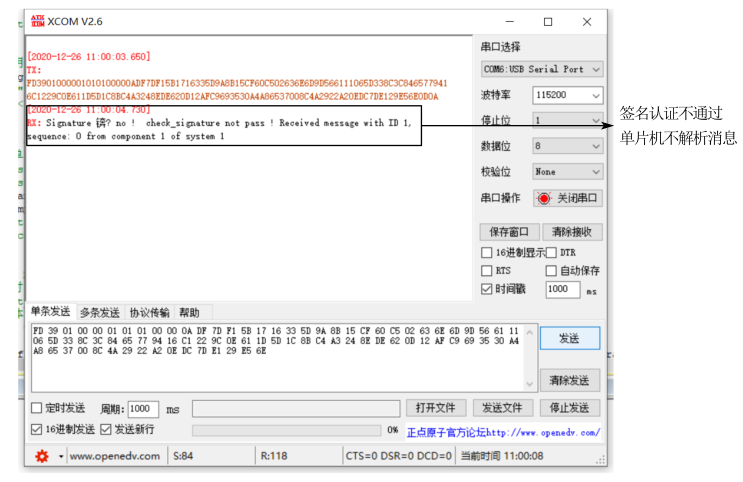
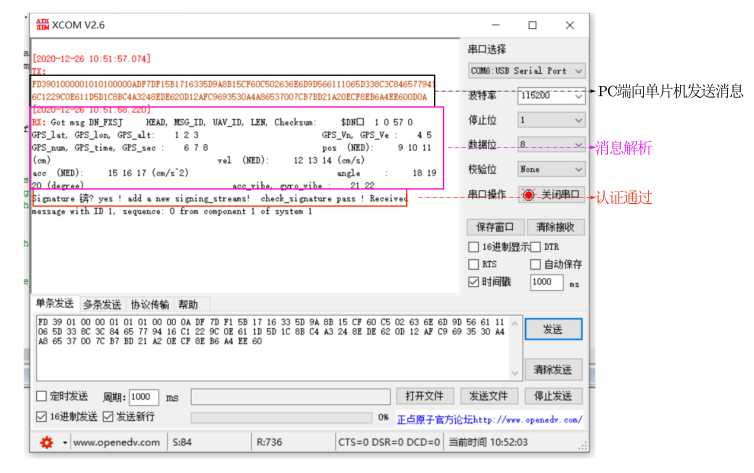
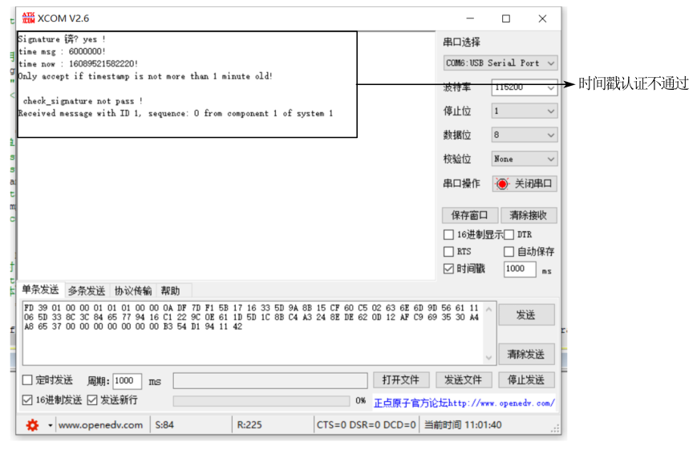

# 大学生创新训练计划实物成果展示

**智能集群无人系统测控链路安全防护技术**

### 实物成果功能

* 实现自定义消息的赋值，同时基于 AES 算法对消息帧进行加密，以此作为 payload 生成mavlink 标准格式的消息结构体 mavlink_message_t。对称加密算法对 payload 的加密增强了防窃听能力。
* 实现基于动态时间戳和密钥签名实现通信协议抗重放的功能。
* 实现基于动态时间戳和密钥签名实现认证技术，具有防篡改机制。

### 功能测试

实现单片机端和 pc 端之间使用 XBee 无线发送和接收消息的功能，通过串口助手查看通信内容。

#### 签名认证测试

通过固定接收方签名密钥，改变发送方生成消息的签名密钥来验证签名认证的有效性。

合法密钥生成的签名可以通过签名认证，单片机能够正常解析消息。

不合法密钥生成的签名不能通过签名认证，单片机不解析消息，避免浪费计算资源。

合法时间戳生成的消息可以通过时间戳认证，单片机能够正常解析消息。

即使签名认证通过，时间戳认证不通过，认证也不通过，此时单片机不解析消息，避免计算资源的浪费，有效抵抗重放攻击。